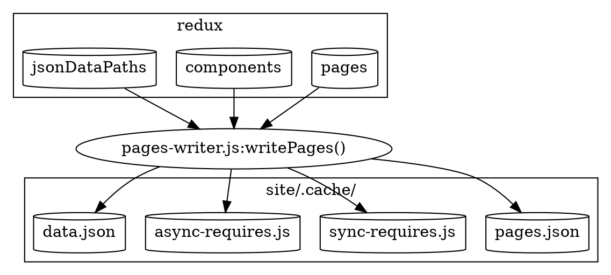

> このドキュメントは Gatsby の最新バージョンに対応していません。
>
> 更新されていない箇所は以下のとおりです。
>
> - `data.json` は `page-data.json` に置き換える必要があります。
> - `pages.json` の記述を削除しました。
> - `match-paths.json` について記述する。
>
> [このドキュメントを更新する](https://github.com/gatsbyjs/gatsby/issues/14228) に PR することで、手助けができます。

これは、コードの最適化とコード分割をするために webpack へ渡す前の、Bootstrap の最後の段階の 1 つです。Webpack は Web バンドルを構築します。Webpack は Gatsby のバックエンドコードに関する知識を持っていません。その代わり、`.cache`ディレクトリーにあるファイルのみを操作します。また、Bootstrap で構築されたすべての Redux の情報へアクセスはできません。そこで、webpack アプリケーションに依存する動的な JavaScript と JSON ファイルを作成します (詳しくはこちらを参照してください [ JavaScript アプリの構築 ](/docs/production-app/))。

今回は、 Bootstrap 中に生成されたすべてのデータを webpack へと使わせるため、ディスクへと保存することだと考えることができます。



今回のコードを裏付けるものは [pages-writer.js](https://github.com/gatsbyjs/gatsby/blob/master/packages/gatsby/src/internal-plugins/query-runner/pages-writer.js) にあります。

作成される動的ファイルは以下のとおりです（以下は全て `.cache` ディレクトリーの下にあります）。

- [pages.json](#pagesjson)
- [sync-requires.js](#sync-requiresjs)
- [async-requires.js](#async-requiresjs)
- [data.json](#datajson)

## pages.json

これは、redux の `pages` 名前空間から作成された、ページオブジェクトの一覧です。各ページには、

- [componentChunkName](/docs/gatsby-internals-terminology/#componentchunkname)
- [jsonName](/docs/gatsby-internals-terminology/#jsonname)
- [path](/docs/gatsby-internals-terminology/#path)
- [matchPath](/docs/gatsby-internals-terminology/#matchpath)

があります。

ページは `matchPath` を持つものが持たない物の前に来るように並び替えられます。これは、[find-page.js](https://github.com/gatsbyjs/gatsby/blob/master/packages/gatsby/cache-dir/find-page.js) が明示的にパスを試す前に正規表現でページを選択させるためです。詳しくは [matchPaths](/docs/gatsby-internals-terminology/#matchpath) をご覧ください。

例えば、

```javascript
;[
  {
    componentChunkName: "component---src-blog-2-js",
    jsonName: "blog-c06",
    path: "/blog",
  },
  // 中略
]
```

この `pages.json` は `gatsby develop` 用にのみ生成されます。`npm run build` では、ページの情報とその他の情報を含む[data.json](/docs/write-pages/#datajson)を使用します。

## sync-requires.js

これは `components` をエクスポートして動的に生成される JavaScript ファイルです。それは `components` redux の名前空間をイテレートして生成されるオブジェクトになります。キーは [componentChunkName](/docs/gatsby-internals-terminology/#componentchunkname)（例： `component---src-blog-2-js`）で、値はそのコンポーネントを必要とする表現です（例： `/home/site/src/blog/2.js`）。ファイルは以下のような感じになります。

```javascript
exports.components = {
  "component---src--blog-2-js": require("/home/site/src/blog/2.js"),
  // 中略
}
```

## async-requires.js

---

`async-requires.js` は動的に生成される JavaScript ファイルという点では `sync-requires.js` とかなりよく似ています。違いは、webpack でのコード分割に使用するため、書かれていることです。そのため、コンポーネントのパスを指定して `require` を使用する代わり、 `import` を使用し、`webpackChunkName` ヒントを追加して、最終的には componentChunkName と結果のファイルを連携させます（詳細は[コード分割](/docs/how-code-splitting-works/)ドキュメントにあります）。`components` は関数なので、遅延して初期化できます。

`async-requires.js` は `data.json` をインポートする `data` 関数もエクスポートします（[参照](/docs/write-pages/#datajson)）。

async-requires の例としては、以下のようなものがあります。

```javascript
exports.components = {
  "component---src-blog-2-js": () =>
    import(
      "/home/site/src/blog/2.js" /* webpackChunkName: "component---src-blog-2-js" */
    ),
  // 中略
}

exports.data = () => import("/home/site/.cache/data.json")
```

`sync-requires.js` は[HTML ページの生成](/docs/html-generation/)で使われることを覚えておいてください。また、`async-requires.js` は[JavaScript アプリの構築](/docs/production-app/)で使用されます。

## data.json

これは、生成された json ファイルです。このファイルには、[前述の通り](/docs/write-pages/#pagesjson)`pages.json`の内容と、[クエリの実行](/docs/query-execution/#save-query-results-to-redux-and-disk)の段階で最後に生成した redux `jsonDataPaths` 全体が含まれています。つまり、下記のような感じです。

```javascript
{
  pages: [
    {
        "componentChunkName": "component---src-blog-2-js",
        "jsonName": "blog-2-c06",
        "path": "/blog/2"
    },
    // ページ省略
 ],

 // jsonName -> dataPath
 dataPaths: {
   "blog-2-c06":"952/path---blog-2-c06-meTS6Okzenz0aDEeI6epU4DPJuE",
   // ページ省略
 }
```

`data.json` は 2 つの場所で使用されています。まず、`async-requires.js` ( 上記 ) で遅延してインポートされ、`production-app` でページの[JSON を読み込む](/docs/production-app/#load-page-resources)に使用されます。

また、[HTML ページ生成](/docs/html-generation/) でも以下の 2 つの方法で使用されることがあります。

1、 `static-entry.js` は、パスに対応する HTML を生成する `page-renderer.js` という webpack のバンドルを生成します。これは `data.json` を必要とし、`pages` を使ってページを探します。
2、 ページオブジェクトから `jsonName` を取得し、それを使って `data.json.dataPaths[jsonName]` で検索し、実際の json 結果のリソースパスを構築しています。

Gatsby がページの情報を書き出したので、[Webpack の章](/docs/webpack-and-ssr/)で起動できます。
